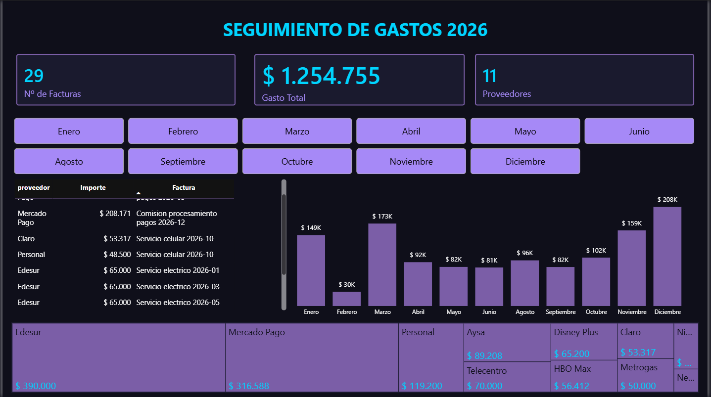

# Automatización de Gastos con IA

Pipeline completo de extracción, procesamiento y visualización 
de facturas usando IA local, SQL y Power BI.

## Flujo del proyecto

1. **Extracción** — Modelo de IA local (Ollama) lee facturas en PDF 
   y extrae datos estructurados automáticamente
2. **Almacenamiento** — Datos persistidos en base de datos SQLite
3. **Visualización** — Dashboard interactivo en Power BI para 
   seguimiento y control de presupuesto

## Dashboard

## 🛠 Stack
Python - Power BI - SQLite - Ollama
